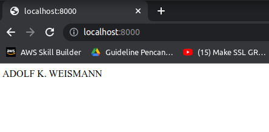
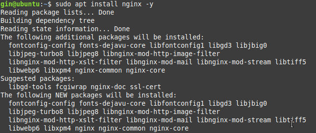

# **BUILT WEB SERVER IN LOCAL SERVER** #

### 1. Clone repository from Github served by Dicoding. ###

First things first, clone repository from Dicoding's Github.  

    git clone https://github.com/dicodingacademy/a387-jarkom-labs.git
  

Second things, you need NodeJS to run this app. So that you have to install NodeJS along with NPM. You can use NVM tool that you learnt before. The minimum NVM version for this project is v14.15.4.  

    curl -o- https://raw.githubusercontent.com/nvm-sh/nvm/v0.39.1/install.sh | bash

    exec bash
    nvm install 14
  

Third, you have to do `npm install` for installing the repository packages.  
  

Fourth, change the node.js web server response that was originally "Hello world!" to be `your full name`. Try to run the app and open the browser.  
  
  

### 2. Install Nginx as Web Server. ###

- Not only NodeJS but also you need to install Nginx as the web server.

        sudo apt install nginx -y
      

- And then you must set up the firewall.  
  

- Change port nginx to be 3000.  

        sudo nano /etc/nginx/sites-available/default

        sudo nginx -t
        sudo systemctl reload nginx
      

- Next, get the browser and input the ip address.  
  

- Make a reverse proxy configuration for the app. Open the browser and check it up.  

        sudo nano /etc/nginx/sites-available/default
      
      

- Here, you can set the rate limit request.  

        limit_req_zone $binary_remote_addr zone=one:10m rate=6r/m;
      
      

### 3. Custom Domain and configuration SSL. ###

- Clone repository from `git@github.com:limonazzo/green-ssl-local.git`.  
- Run cfcfle.sh file.  
        sudo sh cfcfle.sh `your custom domain`

- From that command, you will get 2 files, `.crt & .key`. Copy both of them to new directory.

        sudo mkdir ssl

        cp ssl_certificate /etc/nginx/ssl/appjs.wine.xyz.crt;
        cp ssl_certificate_key /etc/nginx/ssl/appjs.wine.xyz.key;

- Now, config the reverse proxy, example;  
  

- Import certificate to your browser, here I use Google Chrome.  
  
  

- Give a check sign for trusting a new Certificate Authority (CA). Reload your browser, here we go!.  
  